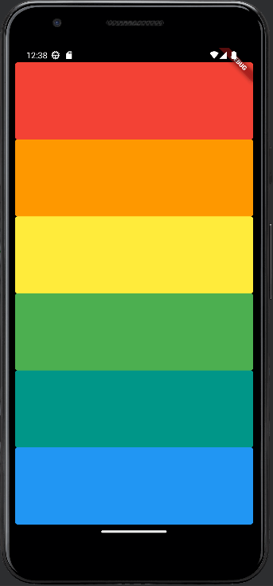

# xylophone

Application de clavier musical simple.

Ce projet est issu d'une [formation](https://www.udemy.com/course/flutter-bootcamp-with-dart/) complete sur udemy dispensée par Angela Yu.

Je suis cette formation en vue d'un stage en mai sur Flutter.

# Eléments travaillés

- fonctions avec paramètres et return
- utilisations de sons
- installation d'une librairie

# Materiel

- Flutter
- Android Studio
- Tablette Lenovo M-10 / Android 10
- Emulateur Pixel 3a / Android 13

# Ressources

- [Udemy / Angela Yu](https://www.udemy.com/course/flutter-bootcamp-with-dart/)
- [Doc Flutter Widget](https://docs.flutter.dev/ui/widgets)
- [Package audioplayers](https://pub.dev/packages/audioplayers)

# Fichier principaux

- Code Flutter : [lib/main.dart](lib/main.dart)
- Configuration : [pubspec.yaml](pubspec.yaml)
- Son : [assets/](assets)

# Example

